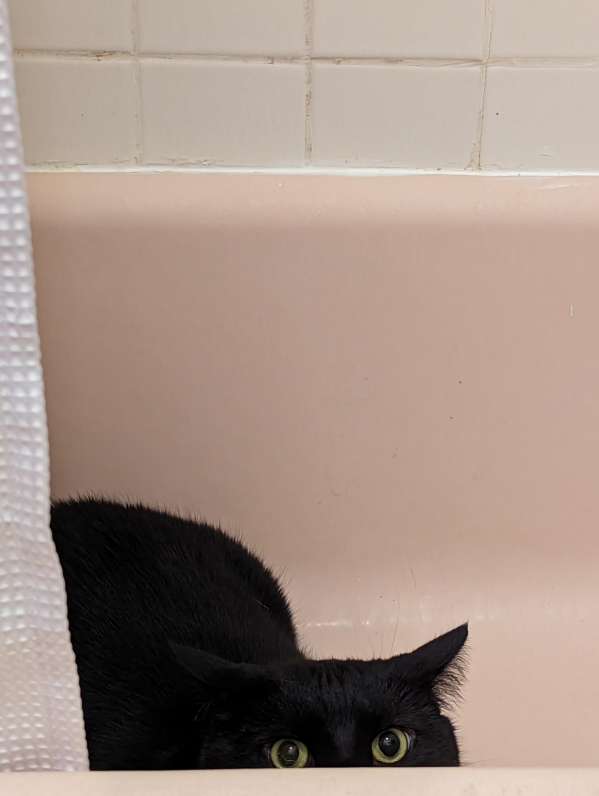

# batR </a>

R package for all the functions that I have made for working on my dissertation and other projects. Particularly helpful to those working with social networks or doings lots of text analysis.

## Install

To install this package run this code in R:
```R
devtools::install_github("timothyelder/batR")
```

## Credit

Named for a very cute cat.

<figure>

    <figcaption>Fig.1 - A Bat.</figcaption>
</figure>